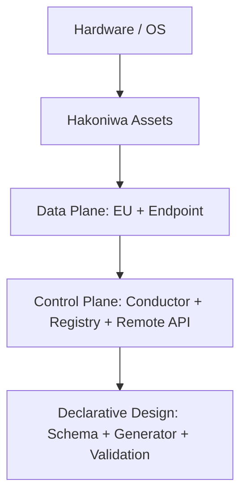
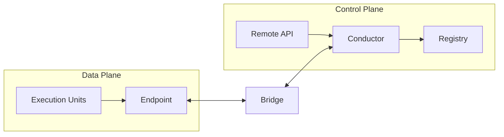
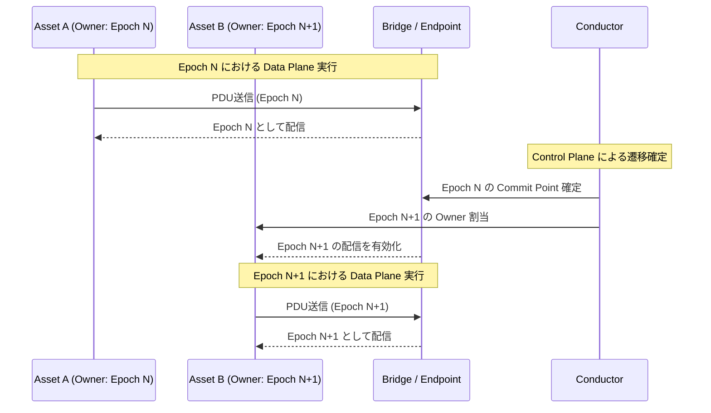

# 図版一覧

(Informative)

本章は、今後維持する図版の一覧とプレースホルダを示す。

## 予定する図版
- スタック（層）図
- Data Plane / Control Plane フロー図
- Epoch / Owner 遷移（概念シーケンス）図
- ランタイムトポロジ図

## スタック（層）図（プレースホルダ）

キャプション: 概念構造を示すスタック図であり、配置や実行環境の具体を表すものではない。Registry は構成情報の保持ロールであり、意味論の権威ではない。

## Data Plane / Control Plane フロー図（プレースホルダ）

キャプション: 概念的な平面分離と境界横断を示す図であり、配置やネットワーク構成の具体を表すものではない。Registry は構成情報の保持ロールであり、意味論の権威ではない。

## Epoch / Owner 遷移図（プレースホルダ）

キャプション: Conductor が Commit Point を確定し、次の Epoch の Owner を割り当てる流れを示す概念図。配置やプロトコル仕様を表すものではない。
