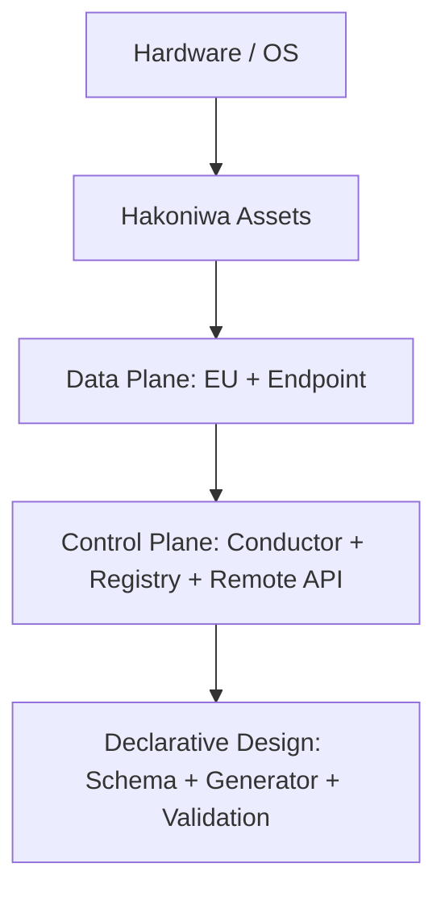
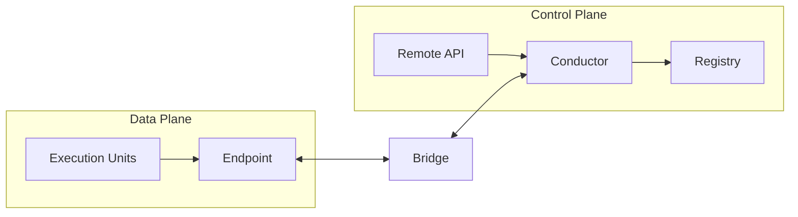
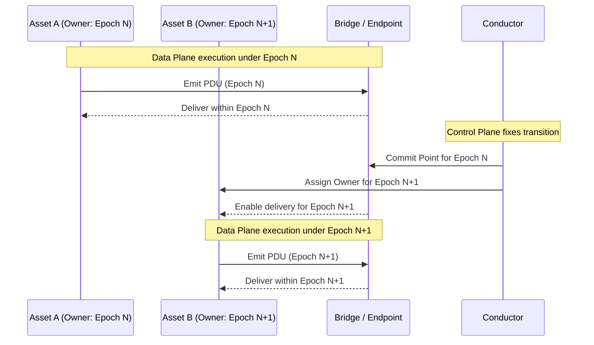

# Diagram Index

(Informative)

This chapter lists the diagrams to be maintained and provides placeholders.

## Planned Diagrams
- Stack (layered) diagram
- Data Plane / Control Plane flow diagram
- Epoch / Owner transition (conceptual sequence) diagram
- Runtime topology diagram

## Stack (Layered) Diagram (Placeholder)

Caption: A conceptual stack view showing major layers and responsibility boundaries. It is not a deployment diagram. Registry is an informative/configuration role, not a semantic authority.

## Data Plane / Control Plane Flow Diagram (Placeholder)

Caption: This diagram shows conceptual plane separation and boundary crossing. It is not a network or runtime deployment diagram. Registry is an informative/configuration role, not a semantic authority.

## Epoch / Owner Transition Diagram (Placeholder)

Caption: A conceptual sequence showing how Conductor fixes a Commit Point and assigns a new Owner for a new Epoch. It is illustrative only and not a deployment or message-protocol specification.
