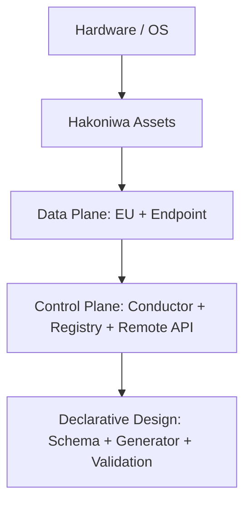
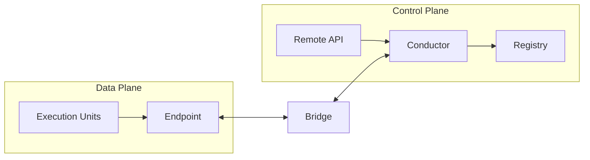

# Diagram Index

(Informative)

This chapter lists the diagrams to be maintained and provides placeholders.

## Planned Diagrams
- Stack (layered) diagram
- Data Plane / Control Plane flow diagram
- Runtime topology diagram

## Stack (Layered) Diagram (Placeholder)

## Data Plane / Control Plane Flow Diagram (Placeholder)

