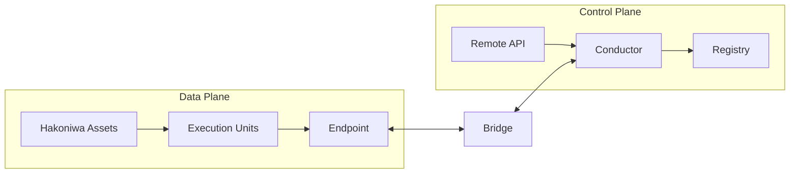

# 箱庭アーキテクチャ全体像

(Normative)

## 目的とスコープ
本章は、箱庭のアーキテクチャを「各要素が何を担うか（責務）」と「その責務の適用範囲や接点をどこで区切るか（境界）」に基づいて定義する。ここで定義される内容は、実装リポジトリに依存しない設計上の規範である。実装の構成や名称は付録に分離し、本章では扱わない。

本ドキュメントにおける **「Normative（設計上の規範）」** とは、実装方式に依存せず、箱庭として成立するために必ず満たすべきルールを指す。規範は「保証すること」と「決めないこと」の境界を定義する。これにより、将来的に実装（言語や通信プロトコル）が変更されても、箱庭としての整合性が揺るがないことを保証する。**「Informative（参考情報）」** は理解の補助であり、準拠義務を持たない。

## データプレーンとコントロールプレーン

### なぜ Runtime Delegation が必要か
大規模シミュレーションを効率的かつ正確に行うには、実行責任を静的に固定せず、状況に応じて移動させる Runtime Delegation（動的委譲）が不可欠である。

例（ドローンの近接衝突回避）:
- **通常時（分散実行）**: 各ドローンが離れている間は別々の Asset で計算し、並列性を最大化する。
- **近接時（集中実行）**: 近づいて衝突の危険が生じた際は、遅延による判定誤差を避けるため、両者の責任を同一 Asset に集約して同期計算を行う。

このように、実行中に Owner を切り替えても時間軸を壊さず、データ欠落や二重書き込みを起こさないことが、本アーキテクチャで厳格な意味論とプレーン分離を要求する最大の動機である。

複雑な分散実行を安定かつ高速に運用するため、本設計では「実際に処理を行う領域（Data Plane）」と「その動きを司る管理領域（Control Plane）」を明確に分離する。

- Data Plane: シミュレーション実行に必要な実データ（PDU等）の伝達・更新・時間進行を担う領域。例: センサー値・姿勢・速度などの状態データの送受信、ステップ進行の実行。
- Control Plane: 実行責任の移譲・世代管理・因果境界の確定・ポリシー適用を担う領域。例: Owner/Epoch の切替、Commit Point の確定、実行ポリシーに基づく遷移判断。

この分離は、性能重視の分散実行と、責任・因果の意味論（Semantics）を両立させるための根本原理である。本書における意味論とは抽象的な理論ではなく、どんなに複雑な分散実行を行っても、データの前後関係や責任の所在を後から解釈し直さなくて済むようにするための設計上の固定ルールを指す。

### 実行責任の委譲という中核課題
本アーキテクチャが解決する最大のランタイム課題は、**実行責任（Owner）の委譲を安全に成立させること**である。意味論が曖昧なまま委譲を行うと、責任の重複、責任の空白、因果の逆転が発生し得る。箱庭はこれを、物理的な通信タイミングではなく設計ルールとして固定する。

- **Epoch による遷移**: 責任の切替を世代の更新として定義する。
- **Commit Point による確定**: 遷移境界は Control Plane が Commit Point で確定する。
- **Owner の一意性**: 任意の Epoch において、EU の Owner は一意で曖昧にならない。

これらの保証は、Data Plane / Control Plane の分離と、Bridge / Endpoint が担う境界ロールによって実装される。

### Data Plane / Control Plane 比較

| Plane | Responsibility | Primary concern | Typical components | What is guaranteed |
| --- | --- | --- | --- | --- |
| Data Plane | 実データの伝達・更新・時間進行 | 実行性能と並列性 | Hakoniwa Asset, EU, Endpoint | データ伝達の因果境界と配信・寿命セマンティクスの明示 |
| Control Plane | 実行責任の遷移・世代管理・因果境界の確定 | 責任の一意性と意味論の確定 | Conductor, Registry, Remote API | Commit Point による責任と因果境界の意味論的確定 |

ここでいう Data Plane / Control Plane は、
一般的な分散システムや Kubernetes における用語とは意味が異なる。

箱庭における Control Plane は、
リソース管理やサービス制御ではなく、
「実行責任と因果境界を確定するための論理的役割」
を指す。

## コンポーネントの設計ロール（責務）
以下は設計上のロールであり、リポジトリ名ではない。

- **Hakoniwa Asset**: OSプロセスとして実行される単位。EU（Execution Unit）の実体を保持し、Data Plane 上で並列に実行する。
- **Execution Unit (EU)**: 論理的な実行主体。複数アセットに実体を持ちうる。EUの所有権（Owner）は常に一意である。
- **Endpoint**: データ伝達の境界。単なるメッセージAPIではなく、**因果境界**および**配信・寿命セマンティクス**を定義する。
- **Bridge**: Data Plane と Control Plane の境界を跨ぐロール。両平面の整合性を維持し、Data Plane の動作を Control Plane が解釈可能な意味論に接続する「翻訳窓口」として機能する。
- **Conductor**: Control Plane の中核。EUの実行責任の遷移を管理し、Epoch と Commit Point を確定する。数値解法の決定や最適化は行わない。
- **Registry**: システム全体の構成・定義情報を保持するロール。責任や因果の意味論は保持しない。
- **Remote API**: 制御操作や外部統合のためのAPI面。Control Plane への操作はここを通じて行われる。

## アーキテクチャ上の保証と非保証
### 保証されること（アーキテクチャレベル）
- Data Plane と Control Plane は責務として分離される。
- 実行責任（Owner）は常に一意である。
- Commit Point において因果境界が意味論的に確定される。
- Endpoint は因果境界と配信・寿命セマンティクスを定義する。

## 因果の境界（定義）
因果の境界とは、分散実行において「どのデータやイベントが、どの実行責任（Owner）や世代（Epoch）に紐付くのか」を曖昧さなく確定させるための設計上の区切りである。これは Endpoint の配信・寿命セマンティクスによって規定され、Commit Point において意味論的に固定される。物理的な開始タイミングのズレとは独立に成立する（例: ネットワーク遅延で到着順が前後しても、Owner/Epoch と Commit Point の境界で帰属は揺らがない）。

### 取り扱わないこと（アーキテクチャレベル）
- 数値解法の選定や最適化方針
- 実行配置や負荷分散の最適化
- 遅延データの数値処理（補間・外挿等）
- 実装の言語・フレームワーク選択

## コア意味論との接続
本章のアーキテクチャは、`architecture/core-functions.md` に定義された最小意味論を、具体的な責務と境界として割り当てるための枠組みである。ここで扱う中核ルールは次のとおり。

| ルール | ひとことで言うと | 割り当ての対象 |
| --- | --- | --- |
| Owner の一意性 | 「いま書き換えてよい主体」が一意である | Conductor / Endpoint |
| Epoch | 実行責任の世代を識別する | Conductor |
| Commit Point | 因果と責任が確定する境界 | Conductor |
| Data/Control 分離 | 実行と管理を混ぜない | Data Plane / Control Plane |
| Endpoint の因果境界 | 入口・出口で因果が逆転しない | Endpoint |

本章では、これらが「どこで、誰によって守られるか」を責務と境界として固定する。

## 概念図（簡易）

