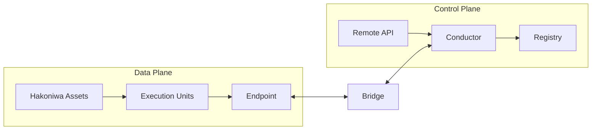

# 箱庭アーキテクチャ全体像

(Normative)

## 1. 目的とスコープ
本章は、箱庭のアーキテクチャを「各要素が何を担うか（責務）」と「その責務の適用範囲や接点をどこで区切るか（境界）」に基づいて定義する。ここで定義される内容は、実装リポジトリに依存しない設計上の規範である。実装の構成や名称は付録に分離し、本章では扱わない。

本ドキュメントにおける **「Normative（設計上の規範）」** とは、実装方式に依存せず、箱庭として成立するために必ず満たすべきルールを指す。規範は「保証すること」と「決めないこと」の境界を定義する。これにより、将来的に実装（言語や通信プロトコル）が変更されても、箱庭としての整合性が揺るがないことを保証する。**「Informative（参考情報）」** は理解の補助であり、準拠義務を持たない。

## 2. 箱庭が前提としている課題と問題設定

箱庭は、単なるメッセージングミドルウェアではなく、物理法則と時間の整合性を維持しながら大規模な分散シミュレーションを行うための基盤である。従来の分散シミュレーションには、以下の解決困難な構造的課題が存在する。

### 2.1 静的配置の限界と計算リソースの偏り
現実世界の物理現象（ドローンの群制御や交通流など）は、空間的・時間的な疎密が激しい。計算リソース（Asset）に対してシミュレーション対象を静的に割り当てると、特定のノードに負荷が集中してリアルタイム性が破綻するか、逆にリソースが無駄になる。

**課題:**

- シミュレーションを止めることなく、負荷や状況に応じて計算主体を動的に再配置（Runtime Delegation）しなければならない。

### 2.2 因果整合性とリアルタイム性のトレードオフ
「全てのデータが正しい順序で届くのを待つ」とシミュレーションは遅くなり、「届いた順に処理する」と因果関係（Aが起きたからBが起きる）が崩壊する。

**課題:**

- 高速なデータ交換（Data Plane）を行いつつ、因果の破綻が許されない局面（衝突判定や所有権移動）では確実に同期をとる（Control Plane）という、相反する要件を両立させなければならない。

### 2.3 因果性保証を時間ズレと分散環境で成立させる難しさ
分散環境では、各ノードの物理時計や処理速度の違いにより、システム全体での「同時刻」を定義することが困難である。物理的な時間の同期を強制すると、通信待ち（ブロッキング）が多発し、シミュレーション性能が著しく低下する。

**課題:**

- 物理的な時間同期に依存せず、論理的な因果関係をどう保証するか。本設計では、この課題に対し後述する Epoch / Commit Point による固定ルールを採用する。

---

## 3. 箱庭のアプローチ：動的集約（Dynamic Aggregation）

これらの課題に対し、箱庭は「分散したまま時間を厳密に同期させる」という従来のアプローチをとらない。 代わりに、**「因果性が重要となる局面（衝突や近接など）において、必要な実行主体を動的に一箇所へ集約する」**ことで、物理的な遅延を排除し、完全な因果性を保証した状態でシミュレーションを実行するアプローチを採用する。

この「動的な集約」を実現するためのキーコンセプトが **Runtime Delegation** であり、それを支える構造が **Control Plane** である。

### Runtime Delegation とは
大規模シミュレーションを効率的かつ正確に行うための核心であり、実行責任を静的に固定せず、状況に応じて動的に移動（委譲）させる機能を指す。

**例：ドローンの近接衝突回避**

**通常時（分散実行）**:

- 各ドローンが離れている間は別々の Asset で計算し、並列性を最大化する。

**近接時（集中実行）**:

- 近づいて衝突の危険が生じた際は、通信遅延による誤判定を避けるため、両者の責任を同一 Asset に集約して同期計算を行う。

つまり、シミュレーション実行中に、実行主体（Owner）を動的に別の計算リソースへ移動させ、**因果関係を崩さずにシミュレーションを継続させること**。これこそが、本アーキテクチャが厳格な意味論的保証を必要とする最大の理由である。

---

## 4. データプレーンとコントロールプレーン

以上の動機（Runtime Delegation の安全な実現）に基づき、本設計では「実際に処理を行う領域（Data Plane）」と「その動きを司る管理領域（Control Plane）」を明確に分離する。

- **Data Plane**: シミュレーション実行に必要な実データ（PDU等）の伝達・更新・時間進行を担う領域。
    - *例:* センサー値・姿勢・速度などの状態データの送受信、ステップ進行の実行。
- **Control Plane**: 実行責任の移譲・世代管理・因果境界の確定・ポリシー適用を担う領域。
    - *例:* Owner/Epoch の切替、Commit Point の確定、実行ポリシーに基づく遷移判断。

この分離は、性能重視の分散実行と、責任・因果の意味論（Semantics）を両立させるための根本原理である。

### 実行責任の委譲という中核課題
本アーキテクチャが解決する最大のランタイム課題は、**実行責任（Owner）の委譲を安全に成立させること**である。意味論が曖昧なまま委譲を行うと、責任の重複、責任の空白、因果の逆転が発生し得る。箱庭はこれを、物理的な通信タイミングではなく以下の設計ルールとして固定する。

1.  **Epoch による遷移**: 責任の切替を世代の更新として定義する。
2.  **Commit Point による確定**: 遷移境界は Control Plane が Commit Point で確定する。
3.  **Owner の一意性**: 任意の Epoch において、EU の Owner は一意で曖昧にならない。

### Data Plane / Control Plane 比較

| Plane | Responsibility | Primary concern | Typical components | What is guaranteed |
| :--- | :--- | :--- | :--- | :--- |
| **Data Plane** | 実データの伝達・更新・時間進行 | 実行性能と並列性 | Hakoniwa Asset, EU, Endpoint | データ伝達の因果境界と配信・寿命セマンティクスの明示 |
| **Control Plane** | 実行責任の遷移・世代管理・因果境界の確定 | 責任の一意性と意味論の確定 | Conductor, Registry, Remote API | Commit Point による責任と因果境界の意味論的確定 |

> **注記:** 箱庭における Control Plane は、リソース管理やサービス制御ではなく、「実行責任と因果境界を確定するための論理的役割」を指す。

---

## 5. コンポーネントの設計ロール（責務）
以下は設計上のロールであり、リポジトリ名ではない。

- **Hakoniwa Asset**: OSプロセスとして実行される単位。EU（Execution Unit）の実体を保持し、Data Plane 上で並列に実行する。
- **Execution Unit (EU)**: 論理的な実行主体。複数アセットに実体を持ちうる。EUの所有権（Owner）は常に一意である。
- **Endpoint**: データ伝達の境界。単なるメッセージAPIではなく、**因果境界**および**配信・寿命セマンティクス**を定義する。
- **Bridge**: Data Plane と Control Plane の境界を跨ぐロール。両平面の整合性を維持し、Data Plane の動作を Control Plane が解釈可能な意味論に接続する「翻訳窓口」として機能する。
- **Conductor**: Control Plane の中核。EUの実行責任の遷移を管理し、Epoch と Commit Point を確定する。数値解法の決定や最適化は行わない。
- **Registry**: システム全体の構成・定義情報を保持するロール。責任や因果の意味論は保持しない。
- **Remote API**: 制御操作や外部統合のためのAPI面。Control Plane への操作はここを通じて行われる。

## 6. アーキテクチャ上の保証と非保証
### 保証されること（アーキテクチャレベル）
- Data Plane と Control Plane は責務として分離される。
- 実行責任（Owner）は常に一意である。
- Commit Point において因果境界が意味論的に確定される。
- Endpoint は因果境界と配信・寿命セマンティクスを定義する。

### 因果の境界（定義）
因果の境界とは、分散実行において「どのデータやイベントが、どの実行責任（Owner）や世代（Epoch）に紐付くのか」を曖昧さなく確定させるための設計上の区切りである。これは Endpoint の配信・寿命セマンティクスによって規定され、Commit Point において意味論的に固定される。物理的な開始タイミングのズレとは独立に成立する。

### 取り扱わないこと（アーキテクチャレベル）
- 数値解法の選定や最適化方針
- 実行配置や負荷分散の最適化
- 遅延データの数値処理（補間・外挿等）
- 実装の言語・フレームワーク選択

## 7. コア意味論との接続
本章のアーキテクチャは、`architecture/core-functions.md` に定義された最小意味論を、具体的な責務と境界として割り当てるための枠組みである。ここで扱う中核ルールは次のとおり。

| ルール | ひとことで言うと | 割り当ての対象 |
| :--- | :--- | :--- |
| **Owner の一意性** | 「いま書き換えてよい主体」が一意である | Conductor / Endpoint |
| **Epoch** | 実行責任の世代を識別する | Conductor |
| **Commit Point** | 因果と責任が確定する境界 | Conductor |
| **Data/Control 分離** | 実行と管理を混ぜない | Data Plane / Control Plane |
| **Endpoint の因果境界** | 入口・出口で因果が逆転しない | Endpoint |

本章では、これらが「どこで、誰によって守られるか」を責務と境界として固定する。

## 8. 概念図（簡易）

