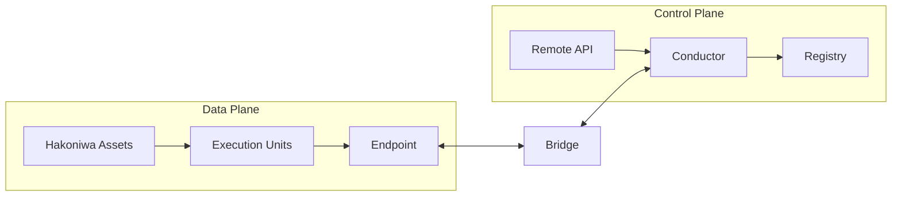

# Hakoniwa Architecture Overview

(Normative)

## Purpose and Scope
This chapter defines the Hakoniwa architecture based on responsibilities and boundaries. The content here is a design norm independent of implementation repositories. Implementation composition and naming are separated into an appendix and are not covered in this chapter.

## Data Plane and Control Plane
Hakoniwa clearly separates the Data Plane and the Control Plane.

- Data Plane: The domain responsible for transmitting, updating, and advancing time for execution data required for simulation (e.g., PDUs).
- Control Plane: The domain responsible for transferring execution responsibility, managing generations, fixing causal boundaries, and applying policies.

This separation is a foundational principle to balance performance-first distributed execution with responsibility and causality semantics.

## Component Design Roles (Responsibilities)
The following are design roles, not repository names.

- **Hakoniwa Asset**: A unit executed as an OS process. It holds EU (Execution Unit) instances and runs in parallel on the Data Plane.
- **Execution Unit (EU)**: A logical execution entity. It can have instances across multiple assets. Ownership (Owner) is always unique.
- **Endpoint**: A boundary for data transfer. It is not a generic messaging API; it defines **causality boundaries** and **delivery/lifetime semantics**.
- **Bridge**: An intermediary role that ensures coherence and connectivity when crossing the boundary between Data Plane and Control Plane.
- **Conductor**: The core of the Control Plane. It manages execution responsibility transitions for EUs and fixes Epoch and Commit Point. It does not decide numerical solvers or optimization.
- **Registry**: A role that holds system-wide configuration and definition information. It does not hold responsibility or causality semantics.
- **Remote API**: The API surface for control operations and external integration. Control Plane operations are performed through it.

## Architectural Guarantees and Non-Guarantees
### Guaranteed (Architecture Level)
- Data Plane and Control Plane are separated by responsibility.
- Execution responsibility (Owner) is always unique.
- Causal boundaries are semantically fixed at Commit Points.
- Endpoint defines causality boundaries and delivery/lifetime semantics.

### Out of Scope (Architecture Level)
- Selection of numerical solvers and optimization policies
- Optimization of execution placement and load balancing
- Numerical handling of delayed data (interpolation, extrapolation, etc.)
- Choice of implementation languages or frameworks

## Concept Diagram (Simplified)

