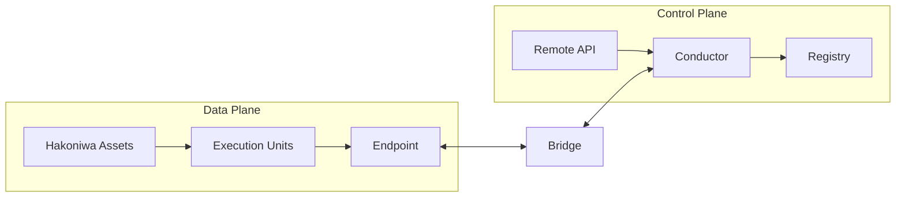

# 箱庭アーキテクチャ全体像

(Normative)

## 目的とスコープ
本章は、箱庭のアーキテクチャを「責務」と「境界」に基づいて定義する。ここで定義される内容は、実装リポジトリに依存しない設計上の規範である。実装の構成や名称は付録に分離し、本章では扱わない。

## データプレーンとコントロールプレーン
箱庭は、Data Plane と Control Plane を明確に分離する。

- Data Plane: シミュレーション実行に必要な実データ（PDU等）の伝達・更新・時間進行を担う領域。
- Control Plane: 実行責任の移譲・世代管理・因果境界の確定・ポリシー適用を担う領域。

この分離は、性能重視の分散実行と、責任・因果の意味論を両立させるための根本原理である。

ここで、本書で用いる「意味論的」という言葉は、抽象理論を指すものではない。
箱庭における意味論とは、
「分散実行において、責任と因果を後から解釈に委ねないための設計上の固定ルール」
を指す。

### Data Plane / Control Plane 比較

| Plane | Responsibility | Primary concern | Typical components | What is guaranteed |
| --- | --- | --- | --- | --- |
| Data Plane | 実データの伝達・更新・時間進行 | 実行性能と並列性 | Hakoniwa Asset, EU, Endpoint | データ伝達の因果境界と配信・寿命セマンティクスの明示 |
| Control Plane | 実行責任の遷移・世代管理・因果境界の確定 | 責任の一意性と意味論の確定 | Conductor, Registry, Remote API | Commit Point による責任と因果境界の意味論的確定 |

ここでいう Data Plane / Control Plane は、
一般的な分散システムや Kubernetes における用語とは意味が異なる。

箱庭における Control Plane は、
リソース管理やサービス制御ではなく、
「実行責任と因果境界を確定するための論理的役割」
を指す。

## コンポーネントの設計ロール（責務）
以下は設計上のロールであり、リポジトリ名ではない。

- **Hakoniwa Asset**: OSプロセスとして実行される単位。EU（Execution Unit）の実体を保持し、Data Plane 上で並列に実行する。
- **Execution Unit (EU)**: 論理的な実行主体。複数アセットに実体を持ちうる。EUの所有権（Owner）は常に一意である。
- **Endpoint**: データ伝達の境界。単なるメッセージAPIではなく、**因果境界**および**配信・寿命セマンティクス**を定義する。
- **Bridge**: Data Plane と Control Plane の境界を跨ぐロール。両平面の整合性を維持し、境界横断の接続性を担保する。
- **Conductor**: Control Plane の中核。EUの実行責任の遷移を管理し、Epoch と Commit Point を確定する。数値解法の決定や最適化は行わない。
- **Registry**: システム全体の構成・定義情報を保持するロール。責任や因果の意味論は保持しない。
- **Remote API**: 制御操作や外部統合のためのAPI面。Control Plane への操作はここを通じて行われる。

## アーキテクチャ上の保証と非保証
### 保証されること（アーキテクチャレベル）
- Data Plane と Control Plane は責務として分離される。
- 実行責任（Owner）は常に一意である。
- Commit Point において因果境界が意味論的に確定される。
- Endpoint は因果境界と配信・寿命セマンティクスを定義する。

### 取り扱わないこと（アーキテクチャレベル）
- 数値解法の選定や最適化方針
- 実行配置や負荷分散の最適化
- 遅延データの数値処理（補間・外挿等）
- 実装の言語・フレームワーク選択

## コア意味論との接続
本章で規定するアーキテクチャ上の保証は、`architecture/core-functions.md` に定義された最小意味論（Owner の一意性、Epoch、Commit Point、Data Plane/Control Plane の分離、Endpoint の因果境界）に基づいて実現される。アーキテクチャは、これらの意味論を構成要素に割り当て、責務と境界として固定する。

## 概念図（簡易）

