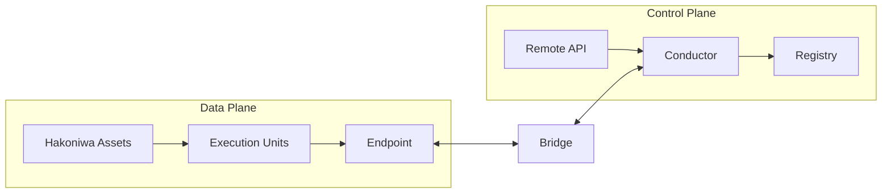

# Hakoniwa Architecture Overview

(Normative)

## Purpose and Scope
This chapter defines the Hakoniwa architecture based on what each element is responsible for and where those responsibilities are delimited and interfaced (boundaries). The content here is a design norm independent of implementation repositories. Implementation composition and naming are separated into an appendix and are not covered in this chapter.

**“Normative（design rules）”** in this document means implementation-independent rules that must be satisfied for a system to be considered “Hakoniwa.” These rules define what the system guarantees and, equally important, what it intentionally does not decide. This separation ensures that future implementation changes (languages or transport protocols) do not compromise Hakoniwa’s consistency. **“Informative（reference）”** content provides context and examples but is not binding.

## Data Plane and Control Plane

### Why Runtime Delegation Is Necessary
Large-scale simulation cannot keep execution responsibility fixed if it is to remain both efficient and accurate. Runtime delegation allows ownership to move as conditions change so that execution can be placed where synchronization or performance is needed.

Example (drone near-collision avoidance):
- **Normal (distributed)**: Each drone is computed on separate assets to maximize parallelism.
- **Near proximity (concentrated)**: When drones approach, responsibility is consolidated to a single asset to avoid delay-induced judgment errors and to run tightly synchronized computation.

This ability to switch Owners during execution without breaking time consistency or causing data loss/duplication is the primary motivation for strict semantics and plane separation.

To operate complex distributed execution both stably and at high performance, the design separates the domain that performs execution (Data Plane) from the domain that governs and manages it (Control Plane).

- Data Plane: The domain responsible for transmitting, updating, and advancing time for execution data required for simulation (e.g., PDUs). Example: exchange of state data such as sensor values, pose, and velocity, and execution of time steps.
- Control Plane: The domain responsible for transferring execution responsibility, managing generations, fixing causal boundaries, and applying policies. Example: Owner/Epoch transitions, Commit Point fixation, and policy-driven transition decisions.

This separation is a foundational principle to balance performance-first distributed execution with responsibility and causality semantics. Here, “semantics” does not refer to abstract theory; it means fixed design rules that prevent data ordering and responsibility attribution from being reinterpreted after the fact in distributed execution.

### Delegation as the Core Runtime Challenge
The central runtime challenge addressed by this architecture is **safe delegation of execution responsibility (Owner)** across distributed assets. Without explicit semantics, delegation can create ambiguity such as overlapping ownership, gaps in responsibility, or causal inversion during transitions. Hakoniwa resolves this by fixing delegation with design rules, not physical timing:

- **Epoch-based transitions**: Responsibility changes are defined as generation transitions, not ad-hoc timing events.
- **Commit Point fixation**: Transition boundaries are fixed by the Control Plane at Commit Points, independent of delivery timing.
- **Owner uniqueness**: For any Epoch, the Owner of an EU is unique and never ambiguous.

These guarantees are enforced by the separation of Data Plane and Control Plane, with Bridge and Endpoint acting as boundary-crossing and causality-fixing roles.

### Data Plane / Control Plane Comparison

| Plane | Responsibility | Primary concern | Typical components | What is guaranteed |
| --- | --- | --- | --- | --- |
| Data Plane | Transmission, update, and time progression of execution data | Execution performance and parallelism | Hakoniwa Asset, EU, Endpoint | Causality boundaries and delivery/lifetime semantics are explicitly defined |
| Control Plane | Responsibility transitions, generation management, causal boundary fixation | Uniqueness of responsibility and semantic fixation | Conductor, Registry, Remote API | Semantic fixation of responsibility and causal boundaries at Commit Points |

## Component Design Roles (Responsibilities)
The following are design roles, not repository names.

- **Hakoniwa Asset**: A unit executed as an OS process. It holds EU (Execution Unit) instances and runs in parallel on the Data Plane.
- **Execution Unit (EU)**: A logical execution entity. It can have instances across multiple assets. Ownership (Owner) is always unique.
- **Endpoint**: A boundary for data transfer. It is not a generic messaging API; it defines **causality boundaries** and **delivery/lifetime semantics**.
- **Bridge**: A boundary-crossing role between the Data Plane and Control Plane. It maintains consistency across both planes and acts as a translation gateway that connects Data Plane behavior to Control Plane semantics.
- **Conductor**: The core of the Control Plane. It manages execution responsibility transitions for EUs and fixes Epoch and Commit Point. It does not decide numerical solvers or optimization.
- **Registry**: A role that holds system-wide configuration and definition information. It does not hold responsibility or causality semantics.
- **Remote API**: The API surface for control operations and external integration. Control Plane operations are performed through it.

## Architectural Guarantees and Non-Guarantees
### Guaranteed (Architecture Level)
- Data Plane and Control Plane are separated by responsibility.
- Execution responsibility (Owner) is always unique.
- Causal boundaries are semantically fixed at Commit Points.
- Endpoint defines causality boundaries and delivery/lifetime semantics.

## Causality Boundary (Definition)
Causality Boundary is a design boundary that fixes, without ambiguity, which data and events are attributed to which execution responsibility (Owner) and generation (Epoch). It is enforced through Endpoint semantics (delivery and lifetime) and is semantically fixed at Commit Points, independent of physical start timing (e.g., even if network delay reorders arrivals, attribution remains fixed by Owner/Epoch and Commit Point boundaries). This removes reliance on physical clock alignment and fixes ordering and responsibility through Epoch and Commit Point semantics.

### Out of Scope (Architecture Level)
- Selection of numerical solvers and optimization policies
- Optimization of execution placement and load balancing
- Numerical handling of delayed data (interpolation, extrapolation, etc.)
- Choice of implementation languages or frameworks

## Link to Core Semantics
The architectural guarantees in this chapter are realized based on the minimum semantics defined in `architecture/core-functions.md` (Owner uniqueness, Epoch, Commit Point, Data Plane/Control Plane separation, and Endpoint causality boundaries). The architecture assigns these semantics to concrete responsibilities and boundaries.

## Concept Diagram (Simplified)

