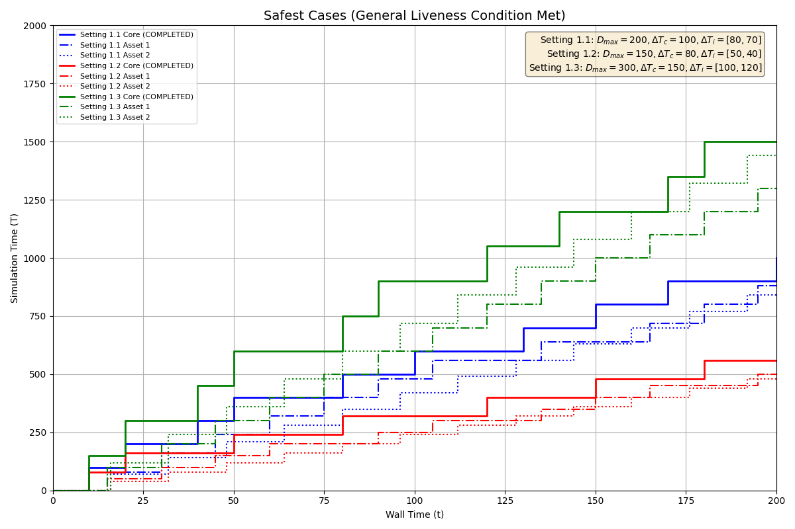
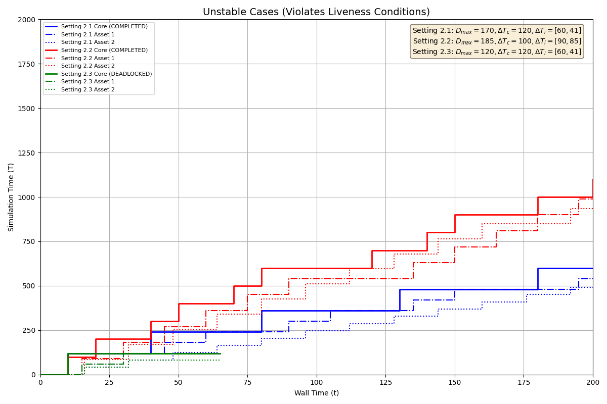
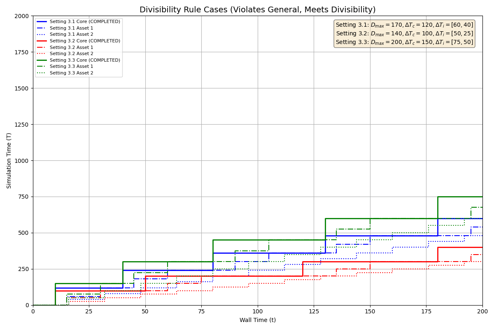

# 進行性(liveness)に関する実験的検証

## 目的

`hakoniwa-time.md`で定義された進行性（liveness）に関するパラメータ条件の分類について、その妥当性を実験によって検証する。

## 検証対象

`hakoniwa-time.md`で示された、進行性条件に関する以下の関係表（大前提を満たす場合に限定）を検証対象とする。

| | 一般進行性条件 ($\Delta T_c + \max_{i}(\Delta T_i) \leq D_{max}$) | 割り切れる条件 ($\Delta T_c \pmod{\Delta T_i} = 0$) | 結果 |
| :--- | :--- | :--- | :--- |
| **最も安全** | **満たす** | （不問） | **進行性を保証** |
| **特別ケース** | 満たさない | **満たす** | **進行性を保証** |
| **不安定** | 満たさない | 満たさない | 進行する場合も、デッドロックする場合もある |

## 実験結果

上記の関係表に対応する3つのカテゴリについて、それぞれ3パターンのパラメータ設定でシミュレーションを実行し、結果を可視化した。

### 1. 「最も安全」な構成の検証

一般進行性条件を満たすパラメータ設定では、シミュレーション時間の進む速度（傾き）は設定ごとに異なるものの、すべてのケースで問題なくシミュレーションが完了することが確認できた。

### 2. 「不安定」な構成の検証

一般進行性条件と割り切れる条件の両方を満たさないパラメータ設定では、その結果は実行タイミングに依存する。今回の実験では、同じカテゴリに属する設定でも、デッドロックに陥るケース（Setting 2.1）と、偶然にも完走するケース（Setting 2.2, 2.3）の両方が観測され、予測通りの不安定な挙動が確認できた。

### 3. 「特別ケース」の構成の検証

一般進行性条件を満たさないが、割り切れる条件を満たすパラメータ設定では、すべてのケースでデッドロックが回避され、シミュレーションが正常に完了することが確認できた。これにより、「割り切れる条件」が進行性を保証する有効な救済策であることが実験的に示された。

## 結論

以上の実験結果から、`hakoniwa-time.md`で示された進行性条件の分類と、その振る舞いの予測は妥当であると結論付けられる。
