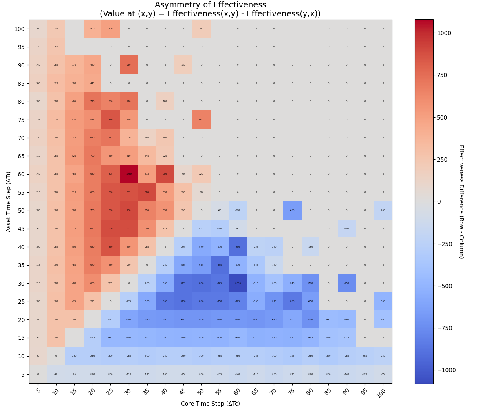

# 進行性(liveness)に関する実験的検証

## 目的

`hakoniwa-time.md`で定義された進行性（liveness）に関するパラメータ条件の分類について、その妥当性を実験によって検証する。

## 検証対象

`hakoniwa-time.md`で示された、進行性条件に関する以下の関係表（大前提を満たす場合に限定）を検証対象とする。

| | 一般進行性条件 ($\Delta T_c + \max_{i}(\Delta T_i) \leq D_{max}$) | 割り切れる条件 ($\Delta T_c \pmod{\Delta T_i} = 0$) | 結果 |
| :--- | :--- | :--- | :--- |
| **最も安全** | **満たす** | （不問） | **進行性を保証** |
| **特別ケース** | 満たさない | **満たす** | **進行性を保証** |
| **不安定** | 満たさない | 満たさない | 進行する場合も、デッドロックする場合もある |

## 実験結果

上記の関係表に対応する3つのカテゴリについて、それぞれ3パターンのパラメータ設定でシミュレーションを実行し、結果を可視化した。

### 1. 「最も安全」な構成の検証

一般進行性条件を満たすパラメータ設定では、シミュレーション時間の進む速度（傾き）は設定ごとに異なるものの、すべてのケースで問題なくシミュレーションが完了することが確認できた。

### 2. 「不安定」な構成の検証

一般進行性条件と割り切れる条件の両方を満たさないパラメータ設定では、その結果は実行タイミングに依存する。今回の実験では、同じカテゴリに属する設定でも、デッドロックに陥るケース（Setting 2.1）と、偶然にも完走するケース（Setting 2.2, 2.3）の両方が観測され、予測通りの不安定な挙動が確認できた。

### 3. 「特別ケース」の構成の検証

一般進行性条件を満たさないが、割り切れる条件を満たすパラメータ設定では、すべてのケースでデッドロックが回避され、シミュレーションが正常に完了することが確認できた。これにより、「割り切れる条件」が進行性を保証する有効な救済策であることが実験的に示された。

## 結論

以上の実験結果から、`hakoniwa-time.md`で示された進行性条件の分類と、その振る舞いの予測は妥当であると結論付けられる。

---

## パラメータ空間の網羅的探索による追加検証

上記に続き、進行性条件の挙動をより深く、視覚的に理解するため、パラメータ空間の網羅的な探索実験を追加で行った。

### 実験目的
1.  $ΔT_c$ と $ΔT_i$ の関係性が進行性に与える影響を、2次元ヒートマップとして可視化する。
2.  理論上の「不安定」領域の挙動を、より多くのサンプルで確認する。
3.  「割り切れる条件」が対称的に機能する可能性を検証し、その場合の性能（有効性）の非対称性を分析する。

### 実験手順
1.  `grid_experiment.py` という実験用スクリプトを作成した。
2.  $D_{max}$ に固定。
3.  $ΔT_c$ と $ΔT_i$ を、それぞれ `5` から `100` まで `5` 刻みで変化させ、`20x20=400`通りの全組み合わせを試行した。
4.  各シミュレーションの `wall_time_duration` は `1001` に設定した。これは、短い実行時間では現れない潜在的なデッドロックを確実に検出するためである。
5.  各コンポーネントの更新チェック間隔は `core_delta_t = 10`, `asset_delta_t_list = [15, 16]` に固定した。

### 実験結果
#### 1. 有効性ヒートマップ
各パラメータ設定におけるシミュレーションの有効性（一定ウォール時間内に進んだシミュレーション時刻 $T_c$ の最終値）をプロットした。灰色はデッドロック、色が明るいほど有効性が高いことを示す。

#### 2. 非対称性ヒートマップ
設定 `(ΔTc, ΔTi)` とその対称な設定 `(ΔTi, ΔTc)` の有効性の差をプロットした。赤色は前者が、青色は後者がより効率的であったことを示す。

### 考察
1.  **理論の視覚的証明**:
    有効性ヒートマップは、理論を極めて明確に可視化した。`ΔTc + ΔTi > 100` の領域（オレンジ色の境界線の右上）が広範囲にわたってデッドロック（灰色）となり、「一般進行性条件」の妥当性が示された。

2.  **割り切れる条件の対称性**:
    灰色のデッドロック領域の中に、シアン色の破線で示された、原点から伸びる「安定する放射状のライン」が多数存在する。これは、`ΔTc % ΔTi = 0` **または** `ΔTi % ΔTc = 0` のいずれかが満たされれば、デッドロックが回避されることを示している。これにより、「割り切れる条件」が**実質的に対称な救済策**として機能することが実験的に証明された。

3.  **性能の非対称性**:
    非対称性ヒートマップを見ると、グラフの左上（`ΔTi < ΔTc`）が赤色に、右下（`ΔTc < ΔTi`）が青色に染まっている。これは、両方の割り切れる条件がデッドロックを回避するものの、その性能（有効性）は異なることを示している。特に、`ΔTc % ΔTi = 0`（赤色領域）の方が、逆のケース（青色領域）よりも有効性が高い傾向が見られる。これは、`plot_single_case.py`で可視化したように、`ΔTi > ΔTc` のケースではコアの待ち時間が増えるためだと考えられる。

### 総合結論
本追加実験により、`hakoniwa-time.md` の理論の正しさを視覚的に証明すると同時に、「割り切れる条件」がこれまで記述されていなかった対称的な性質を持つこと、しかしその性能には非対称性が存在すること、という新たな知見を得ることができた。
