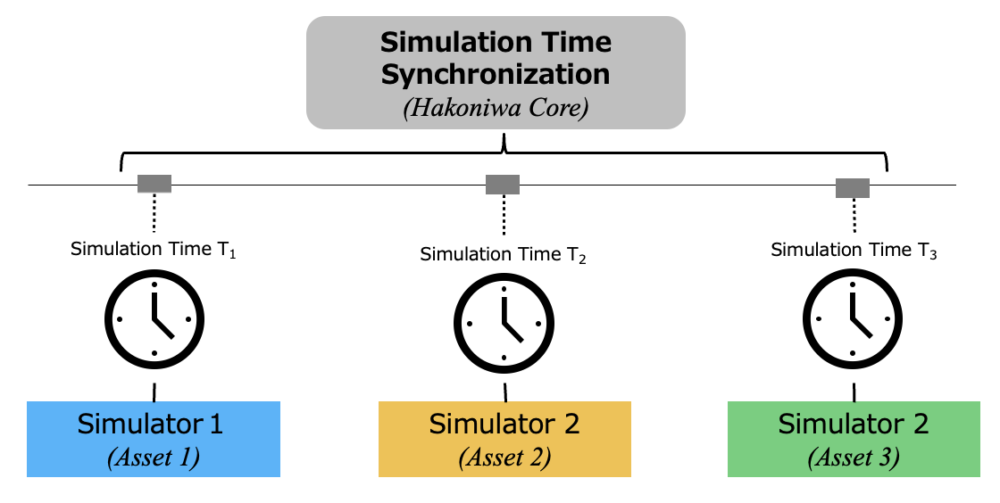
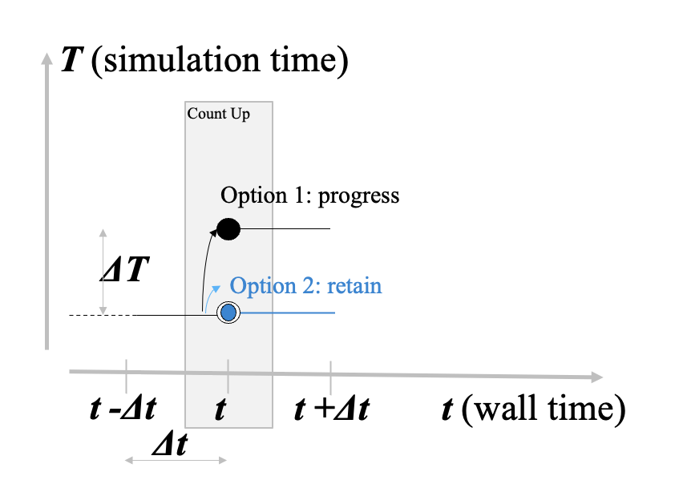
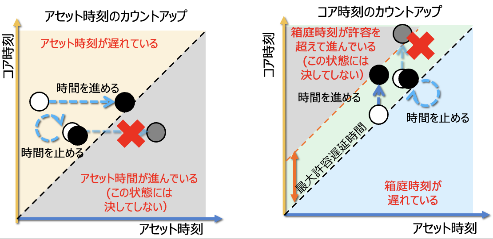
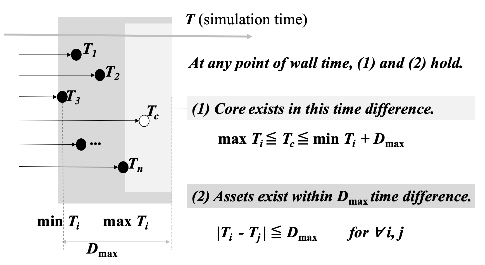
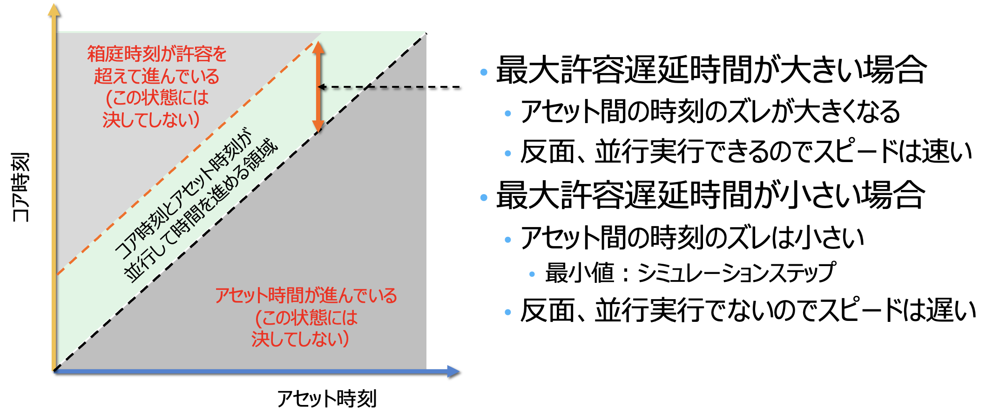
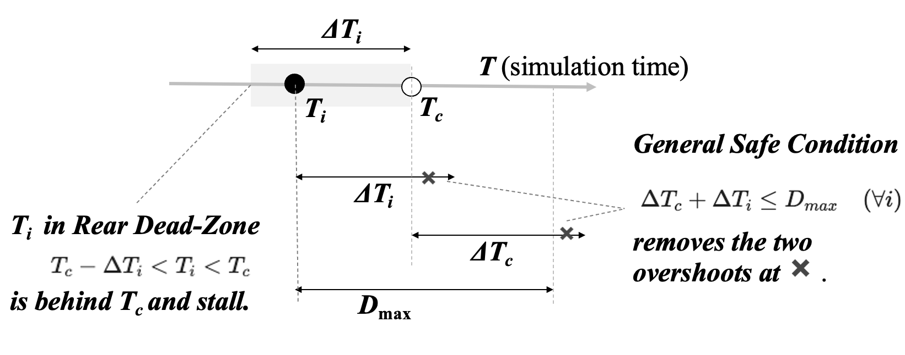
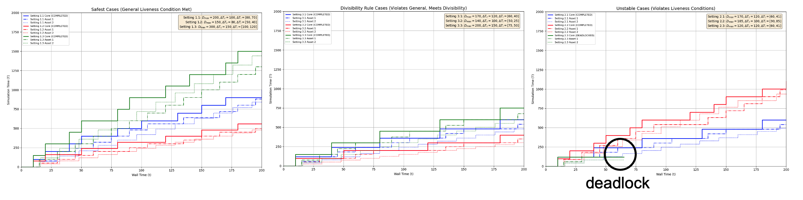
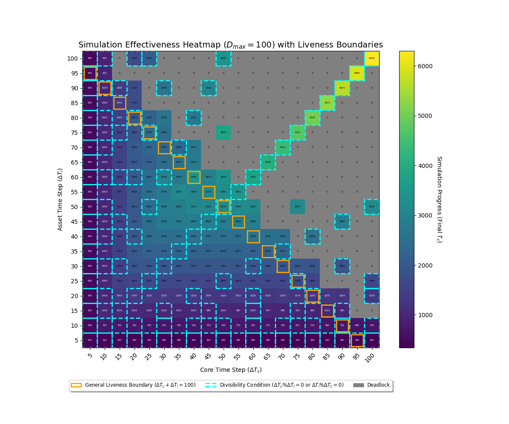
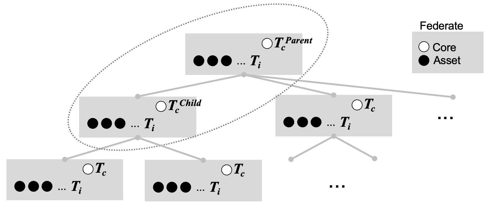

# 変更履歴

**このドキュメントが最新です**
- (Version 3.1) https://github.com/toppers/hakoniwa-px4sim/issues/340 , issue #69 箱庭時刻同期の数学的証明より移動
- (Version 3.2) https://github.com/toppers/hakoniwa-core-cpp-client/issues/69#issue-2541993494 より移動
- (Version 4.0) https://github.com/toppers/hakoniwa-paper/tree/main/robosym2025 高瀬先生により論文化される（そこからのフィードバック戻し）
- (Version 4.1) 査読結果を一部反映
- (Version 5.2) 一般進行条件と割り切れる条件、の考察と実験追加
- (Version 5.3) https://github.com/hakoniwalab/hakoniwa-design-docs/math/hakoniwa-time.md 複数フェデレート対応中

#   概要

箱庭は、複数のシミュレータを繋いで連携動作させるシミュレーションハブである。本簡易論文では、箱庭の中心モジュールである箱庭コア（以降コア）と各シミュレータ（以降アセット）間の時刻同期の考え方を公理的に定義し、それによって、各シミュレータが独自に動作していても、全アセットがあらかじめ設定された最大許容遅延時間内で同期されていることを数学的に証明する。

さらに、行われた定式化をシミュレーション実験結果と比較し、結論の正当性を確認する。さらに、定式化とシミュレーションに基づいて、なるべく早くシミュレーションが進むようなパラメータの設定についても統計的に考察する。

# 定義

以下に、問題の置かれている環境、条件、想定、および、変数名等を定義する。

## コアとアセット

箱庭全体システムは、1つのコアと複数のアセットからなる。

- コア ( $Core$ )： 箱庭のコアであり、自分のシミュレーション時刻であるコア時刻を持ちながら全体のタクト（指揮棒）を担当する。
- アセット( $Asset$ )： 各（サードパーティ製を含む）シミュレータ。サードパーティのシミュレータは、コアとの小さな通信インターフェイスを作成することによってアセット化され、コアと通信する。アセットは、独自のシミュレーション時刻であるアセット時刻を内部に持っている。

シミュレータの特性上、実時間よりも速く進む時間を使うことで、実世界での実験よりも高速にシミュレーションを行う、といった利用法が想定される。例えば、実時間では1日かかるシミュレーションが10秒で完了する、などの利点がある。さらに、入出力に時間のかかる他のシミュレータを待ったり、デバッガで止まったシミュレータに合わせて他のシミュレータも止めるなどの利用法も考えられる。

コアとアセットは、同一あるいはネットワーク接続された計算機上のソフトウェアによる実現を前提としており、それぞれの内部にシミュレーション時刻を保有している。また、両者は通信やメモリにより、自由なタイミングにて、お互いの時刻を知ることができる。コアは $1$ つ。アセットは全部で $n$ 個あり、 $1 \ldots n$ の番号が振られている。

## シミュレーション時刻とウォール時刻

実世界の時刻をウォール時刻 $t$ と呼ぶ。また、コアとアセットはそれぞれ、任意の現在ウォール時刻 $t$ で自身もしくはコアの内部シミュレーション時刻を知ることができる。ウォール時刻には、小文字の $t$ を、シミュレーション時刻には、大文字の $T$ を使うことにする。

- $t$ - ウォール時刻（実世界の時刻）。独立変数（ $\geq 0$ ）。
- $T_c(t)$ - ウォール時刻 $t$ におけるコアのシミュレーション時刻。 $t$ の従属変数（ $\geq 0$ ）。
- $T_i(t)$ - ウォール時刻 $t$ におけるアセット $i$ のシミュレーション時刻（ $i = 1 \ldots n$ ）。 $t$ の従属変数（ $\geq 0$ ）。

これらは、すべて正の実数（ $t \in \mathbb{R}, t \geq 0$ ）として以下議論するが、実際の計算機上では十分な精度を持った整数型もしくは、浮動小数点型として保持する。

さらに、シミュレーション時刻の更新（カウントアップ）について、以下の規則を設ける。

## カウントアップ

- コアおよびアセットは、それぞれ一定ウォール時間間隔で自己のシミュレーション時刻を更新する。この動作を「カウントアップ」という。
- カウントアップは、コアおよびアセット $i$ 毎にそれぞれ定義されたウォール時間間隔 $\Delta t_c, \Delta t_i (> 0)$ で行われる。
- カウントアップ時には、「他者の時刻を取得」し、「自己の時刻を修正」する。本稿の基本モデルでは、通信遅延・処理時間・計算機間の時計ずれはないと仮定し（強い仮定）、これらがある場合は別モデルとして扱う。
- 1回のカウントアップ時に更新（前回時刻への追加）されるシミュレーション時間間隔は、 コア、アセットそれぞれ、 $\Delta T_c, \Delta T_i(>0)$  （進行: progress）、もしくは $0$（停留: retain） である。

この仮定により、それぞれのシミュレーション時刻は、踊り場を持つ階段状に、一定上昇幅で広義単調増加する。

# カウントアップと規則

動機は、 $n$ 個のアセットとコアのシミュレーション時刻を、想定される範囲内で同期させることである。
具体的には、アセットはコアより早く進むことはなく、コアはアセットよりも許容時間幅を超えて早く進むことはないようにしたい。そのために、カウントアップ時には以下の規則を設ける。

コアとアセットのシミュレーション時刻ずれの許容時間間隔を、「最大許容遅延時間」 $D_{max} (>0)$ として定義する。

- $D_{max}$ - 最大許容遅延時間(Maximum Delay Tolerance)

### 初期状態の一致

$$
T_i(0) = T_c(0) = 0  \ldots 初期においてすべてのアセット i とコアのシミュレーション時刻は一致している。
$$

### アセットのカウントアップ規則

各アセット $i = 1 \ldots n$ は、以下の更新規則に従う。

ウォール時刻 $t$ において、前回シミュレーション時刻 $T_i(t - \Delta t_i)$ と現在のコアシミュレーション時刻 $T_c(t)$ から、新しいシミュレーション時刻 $T_i(t)$ を決定する。

新シミュレーション時刻 $T_i(t)$は、前シミュレーション時刻を規定幅 $\Delta T_i$ だけ進めたと想定した値（想定新時刻 $T_i'(t)$ ）が、コアの現時刻 $T_c(t)$ を追い越さないように確定する。

- カウントアップ間隔

$$
\Delta t_i \ldots ウォール時間間隔（ アセット i 毎に異なってよい）
$$

- 1 回の時刻増加幅

$$
0 もしくは \Delta T_i \ldots シミュレーション時間間隔（ i 毎に異なってよい）
$$

- 想定新時刻

$$
T_i'(t) = T_i(t - \Delta t_i) + \Delta T_i
$$

- 確定新時刻
 
$$
T_i(t)  =
\begin{cases}
T_i'(t)  & (T_i'(t)  \leq T_c(t) の時) \ldots 進行 (a.1) \\
T_i(t - \Delta t_i) & (T_c(t) \lt T_i'(t) の時) \ldots 停留 (a.2) (※note: ここで T_c(t) まで進行させる案もある)
\end{cases}
$$

- アセット時刻更新における保存則

上記ルールによって、すべてのアセット $i$ について以下の不等式が、すべてのウォール時刻 $t$ について成り立つ。

$$
T_i(t)  \leq T_c(t) \quad (\forall i) \ldots (a.3)
$$

すなわち、

$$
\max_{i = 1 \ldots n} T_i(t) \leq T_c(t) \ldots (a.4)
$$

### 証明

初期条件およびシミュレーション時刻更新ルールから、数学的帰納法による。すなわち、(a.3)および(a.4)が、

1. $t=0$ で上記条件が成り立っていることが確かめられる。
2. $N-1$ 回目カウントアップ時に成り立っていれば、 $N$ 回目カウントアップにおいても、成り立っていることが、カウントアップ規則から確かめられる。

よって、すべてのカウントアップ時において、(a.3) は維持される。また、関数 $T_i(t)$ がカウントアップ時以外の領域では定数関数であることから、(a.3) は任意の $t \geq 0$ について成り立つ。(a.4) は (a.3) の $i$ による総称を $\max$ を使った表記に書き換えたのみ。

（note: ここでは、 $\Delta t_i$ は固定長としているが、それが $t$ によって変化する場合でも、ウォール時間点列として単調増加な数列、 $t = 0, t_1, t_2, \ldots$ を取れば同様の証明ができる。）

### コアのカウントアップ規則

コアも同様に、ウォール時刻 $t$ において、前回シミュレーション時刻 $T_c(t - \Delta t_c)$ と $n$ 個のアセットシミュレーション時刻 $T_i(t) (i = 1 \ldots n)$ から、自身の新しいシミュレーション時刻 $T_c(t)$ を決定する。

新シミュレーション時刻 $T_c(t)$ は、前シミュレーション時刻を規定幅 $\Delta T_c$ だけ進めたと想定した値（想定新時刻 $T_c'(t)$ ）が、どのアセットの現時刻 $T_i(t)$ も、許容幅 $D_{max}$ を超えて追い越さないように確定する。（ここで、 $D_{max}$ は $\Delta T_c, \Delta T_i$ に比べて大きい必要がある：後述のデッドロック参照）。

- カウントアップ間隔

$$
\Delta t_c \ldots  ウォール時間間隔
$$

- 1 回の時刻増加幅

$$
0 もしくは \Delta T_c \ldots  シミュレーション時間間隔
$$

カウントアップの際、新時刻値は、コアの現時刻を進めたと想定した値（想定新時刻）が、他のアセットの現時刻より **最大許容遅延時間 $D_{max}$ を超えて進んでしまわないように** 確定する。

- 想定新時刻

$$
T_c'(t) = T_c(t - \Delta t_c) + \Delta T_c
$$

- 想定最大遅延幅

$$
D'_{max} = \max_{i = 1 \ldots n}(T_c'(t) - T_i(t))
$$

- 確定新時刻

$$
T_c(t)  =
\begin{cases}
T_c'(t)  & (D'_{max}  \leq D_{max} の時) \ldots 進行 (b.1) \\
T_c(t - \Delta t_c) & (D_{max} \lt D'_{max} の時) \ldots 停留 (b.2) 
\end{cases}
$$

- コア時刻更新における保存則

上記規則によって、すべてのアセット $i$ について以下の不等式が、すべてのウォール時刻 $t$ について成り立つ。

$$
T_c(t)  \leq T_i(t) + D_{max} \quad (\forall i) \ldots (b.3)
$$

すなわち、

$$
T_c(t)  \leq \min_{i = 1 \ldots n}  T_i(t) + D_{max} \ldots (b.4)
$$

### 安全性の証明（上記条件が常に満たされる）

アセットの場合と同様に、初期条件およびシミュレーション時刻更新ルールから、数学的帰納法による。すなわち、

1. $t=0$ で上記条件が成り立っていることが確かめられる。
2. $N-1$ 回目カウントアップ時に成り立っていれば、 $N$ 回目カウントアップにおいても、成り立っていることが、カウントアップ規則から確かめられる。

よって、すべてのカウントアップ時において、(b.3) は維持される。また、関数 $T_c(t)$ がカウントアップ時以外の領域では定数関数であることから、(b.3) は任意の $t \geq 0$ について成り立つ。

ここでは、 $\Delta t_i$ は固定長としているが、それが $t$ によって変化する場合でも、ウォール時間点列として単調増加な数列、 $t = 0, t_i, t_2, \ldots$ を取れば同様の証明ができる。

(b.4) は (b.3) の $i$ による総称を $\min$ を使った表記に書き換えたのみ。

### 終了時

シミュレーションは終了しない無限ループとして実現できる。その場合、上記条件はいかなる時刻でも成立している。
明示的な停止の際にはコアがカウントアップを止めることで行われる場合と、あるアセットがカウントアップを止めることで行われる場合がある。
どちらの場合でも、上記条件が成立したままで、シミュレーションは終了する。

# シミュレーション時刻について得られた安全性の結論

前述した2つの等式を再掲する。 これらは、 $t \geq 0$ について恒等的に成立する。

- どのアセットのシミュレーション時刻も、コアのシミュレーション時刻より進んでいない。

$$
\max_{i = 1 \ldots n} T_i(t) \leq T_c(t) \ldots (c.1)
$$

- コアのシミュレーション時刻は、どのアセットのシミュレーション時刻より、最大許容遅延時間を超えて進んでいない。

$$
T_c(t)  \leq \min_{i = 1 \ldots n}  T_i(t) + D_{max} \ldots (c.2)
$$

この2つの命題より、次の2つの重要な命題がなりたつ。これが本小論文の最初の結論である。

- コアのシミュレーション時刻は、最も進んだアセット時刻より遅れておらず、最も遅れたアセット時刻より最大許容遅延時間を超えて進んでいない。

$$
\max_{i = 1 \ldots n} T_i(t) \leq T_c(t) \leq \min_{i = 1 \ldots n}  T_i(t) + D_{max} \ldots (c.3)
$$

さらに、この不等式の中央にある $T_c(t)$ を省くことで、

- 最も進んだアセットと最も遅れたアセットのシミュレーション時刻差は、高々最大許容遅延時間である、

$$
\max_{i = 1 \ldots n} T_i(t) \leq \min_{i = 1 \ldots n}  T_i(t) + D_{max} \ldots (c.4)
$$

すなわち、アセットのペア $(i, j)$ について以下が言える。

- どんなアセットのペア $(i, j)$ を選んでも、シミュレーション時刻差は最大許容時間以内である。

$$
| T_i(t) - T_j(t) | \leq D_{max} \quad (\forall i, j) \ldots (c.5)
$$

**これは、コアのシミュレーション時刻を調停役（タクト）にして、お互いに直接干渉し合わない別々のアセットが、最大許容遅延時間以内で調歩同期していると言える。**

# パラメータについての考察

パラメータの設定によって、シミュレーション時間にはトレードオフが発生する。

# デッドロック回避（進行性）

時刻同期の性質は、以下の2つに大別される。

- **安全性（Safety）**: 本稿前半で証明した、コアとアセット間の時間差が常に $D_{max}$ 以内に収まるという不変条件。
- **進行性（Liveness）**: いずれかのコンポーネント（コアまたはアセット）が有限時間内に必ず時刻を前進させ、システム全体が決코して停止しないこと。

カウントアップ規則は安全性（Safety）を保証するが、それだけでは進行性（Liveness）は保証されない。ここでは、進行性を保証するためのパラメータ条件を整理する。

### 1. 進行性のための基本要件（大前提）

これらは、シミュレーションが論理的に破綻せず、進行しうるための最低限の必須条件である。

- $0 < \Delta T_c \leq D_{max}$
  - **理由**: コアが最初のステップ（ $T_c=0, T_i=0$ ）で進行するために必要。もしコアの1回のジャンプ量 $\Delta T_c$ が、許容される最大遅延幅 $D_{max}$ より大きい場合、コアは時刻0から動けず、システムは開始と同時にデッドロックする。

- $0 < \Delta T_i \leq D_{max} \quad (\forall i)$
  - **理由**: あるアセット $i$ が、コアから許される最大限まで遅れた状態 ( $T_i = T_c - D_{max}$ ) になった際の復帰に必要。このとき、コアはアセット $i$ を待つため進行を停止する。システムの回復はアセット $i$ の進行にかかっているが、もし $D_{max} < \Delta T_i$ であった場合、アセットが進行しようとすると、 $T_i + \Delta T_i = (T_c - D_{max}) + \Delta T_i = T_c + (\Delta T_i - D_{max}) > T_c$ となり、コア時刻を超えるため進行できない。結果、両者とも永久に動けずデッドロックとなる。厳密には、このデッドロックは $T_i = T_c - D_{max}$ の一点でなくとも、アセットが以下のゾーンに入った場合に発生する。 
$T_c - \Delta T_i < T_i \leq T_c - D_{max}$
（このゾーンは $D_{max} < \Delta T_i$ の場合に存在する）

### 2. 進行性を保証する十分条件

上記の大前提が満たされた上で、進行性を **完全に保証する** ためには、以下の2つのうち、いずれか一方の条件を満たす必要がある。

#### 2.1. 一般進行性条件

これは、パラメータの組み合わせによらず、 **常に進行性を保証する最も強力な十分条件** である。

$$
\Delta T_c + \Delta T_i \leq D_{max} \quad (\forall i) \ldots (d.1)
$$

もしくは、同値条件として、

$$
\Delta T_c + \max_{i}(\Delta T_i) \leq D_{max} \ldots (d.1')
$$

**証明**:
デッドロックは、ある $i$ について、コア $T_c$ とアセット $T_i$ がともに動けない状態である。

$$
T_c < T_i + \Delta T_i \ldots (d.2)  アセット i が動けない
$$

$$
D_{max} + T_i < T_c + \Delta T_c \ldots (d.3) コアが動けない
$$

上記の2式を辺々足し算することにより、 $T_i, T_c$ を消去して、

デッドロック時に必ず満たされている条件：

$$
D_{max} < \Delta T_i + \Delta T_c \ldots (d.4)
$$

が起こっていることになる。対偶を取れば、上記を否定した(d.1)が成り立てば、デッドロックに陥らないことが保証される。
すなわち、(d.1)は進行性の十分条件である。
なお、この十分条件（ $\Delta T_c + \Delta T_i \leq D_{max} \forall i$ ）を満たせば、前述の「基本要件（大前提）」は自動的に満たされる。

#### 2.2. 割り切れる条件（特別な十分条件）

もう一つ、デッドロックが起こらない十分条件が存在する。
これは、 **一般進行性条件が満たされない場合の「救済策」** となる、特殊なケースで進行性を保証する十分条件である。

- $\Delta T_i \leq \Delta T_c$ のとき

$$
\Delta T_c \mod{\Delta T_i} = 0 \quad (\forall i) \ldots (d.5)
$$

もしくは、

- $\Delta T_c < \Delta T_i$ のとき

$$
\Delta T_i \mod{\Delta T_c} = 0 \quad (\forall i) \ldots (d.6)
$$

$\Delta T_i, \Delta T_c$ の大小関係によって、このどちらかが成り立てば、デッドロックは起こらない。

**証明**:

(d.5)は、 $\Delta T_i \leq \Delta T_c$ のときである。

この条件は、(d.2) となる状態にアセットが入らないことを防ぐ。(d.2)が成り立つとき、 $T_i$ の上界と下界を考えると、

$$
T_c - \Delta T_i < T_i < T_c \ldots (d.7)
$$

が成立することになるが、「割り切れる条件」(d.5)が成立する場合、 $T_c$ と $T_i$ は共に $\Delta T_i$ の整数倍となる。
このとき、上記(d.7)の不等式の各項を $\Delta T_i$ で割ると、  $N_c = T_c/\Delta T_i, N_i = T_i/\Delta T_i$ を整数として、
$$
N_c - 1 < N_i < N_c
$$
連続する整数の間に別の整数は存在しないため、(d.2)は決して満たされない。すなわち、デッドロックは発生しない。

(d.6) は、$\Delta T_c < \Delta T_i$ のときである。

この条件は、(d.3) となる状態にコアが入らないことを防ぐ。(d.2),(d.3)が同時に成り立つとすると、動けなくなった最遅アセット $i$ について $T_c$ の上界と下界を考えると、 

$$
D_{max} + T_i - \Delta T_c < T_c < T_i + \Delta T_i \ldots (d.8)
$$

が成り立つ。「割り切れる条件」(d.6)が成立する場合、 $T_c$ と $T_i$ は共に $\Delta T_c$ の整数倍となる。
上記(d.8)の不等式の各項を $\Delta T_c$ で割ると、$N_c = T_c/\Delta T_c, N_i = T_i/\Delta T_c, K = \Delta T_i/\Delta T_c$ を整数として
 
$$
(D_{max}/\Delta T_c) + N_i - 1 < N_c < N_i + (\Delta T_i/\Delta T_c) \\
(D_{max}/\Delta T_c)  - 1 < N_c - N_i < (\Delta T_i/\Delta T_c)
$$

最右辺は、整数なので、

$$
(D_{max}/\Delta T_c)  - 1 < N_c - N_i \leq (\Delta T_i/\Delta T_c) -1
$$

この両端を見ると、 $D_{max} < \Delta T_i$ が成り立っているが、この条件は最初の大前提に違反する。
よって、(d.8)は決して満たされず、デッドロックは起こらない。

### 3. 不安定な構成

「基本要件」は満たすが、「一般進行性条件」と「割り切れる条件」のどちらも満たさない構成。この場合、進行性（liveness）は保証されない。シミュレーションは完走するかもしれないし、デッドロックするかもしれない。その結果は、各コンポーネントの更新タイミング（ $\Delta t_c, \Delta t_i$ ）という偶然の要素に左右される。

### 4. 進行性条件のまとめ

前提： $0 \leq \Delta T_c,\Delta T_i \leq D_{max}$

| | 一般進行性条件 ($\Delta T_c + \max_{i}(\Delta T_i) \leq D_{max}$) | 割り切れる条件 ($\Delta T_c \mod{\Delta T_i} = 0$) | 結果 |
| :--- | :--- | :--- | :--- |
| **最も安全** | **満たす** | （不問） | **進行性を保証** |
| **特別ケース** | 満たさない | **満たす** | **進行性を保証** |
| **不安定** | 満たさない | 満たさない | 進行する場合も、デッドロックする場合もある |

## 実験による進行性条件の可視化

実験結果の詳細は [liveness-experiment](experiment/liveness-experiment.md) を参照。

「一般進行性条件」、「割り切れる条件」、「どちらもみたさない条件」をそれぞれ数パターンで検証した。
最後のケース

また、その挙動を視覚的に理解するため、パラメータ空間の網羅的な探索実験を行った。

### 実験設定
- $D_{max}$ : `100`
- $\Delta T_c$ (コア時間ステップ): `5` から `100` まで `5` 刻み (20通り)
- $\Delta T_i$  (アセット時間ステップ): `5` から `100` まで `5` 刻み (20通り)

上記 $20 \times 20=400$ 通りのパラメータの組み合わせについてシミュレーションを実行し、各設定におけるシミュレーションの「有効性（最終的なコア時刻 $T_c$ のウォール時刻）」を計測した。

### 結果と考察

実験結果を以下のヒートマップに示す。色の明るさ（黄色に近いほど）は有効性が高い（シミュレーションが速く進んだ）ことを示し、灰色のセルはデッドロックが発生したことを示す。

このヒートマップから、以下の2点が明確に見て取れる。

1.  **一般進行性条件の可視化**: `ΔTc + ΔTi > 100` となるパラメータ領域（グラフの右上領域）が、広範囲にわたってデッドロック（赤色）となっている。これは、「一般進行性条件」が破られるとシステムが不安定になるという理論と完全に一致する。

2.  **割り切れる条件（救済策）の可視化**: 赤色のデッドロック領域の中に、点々と存在する明るい「安定の島」が確認できる。これらは、`ΔTc` が `ΔTi` で割り切れる（`ΔTc % ΔTi = 0`）という「割り切れる条件」が満たされた点（例：`(ΔTc=80, ΔTi=40)`, `(ΔTc=100, ΔTi=20)`）に対応しており、一般進行性条件が満たされなくても、この救済策によって進行性が保証される様子が明瞭に示されている。

以上の実験結果は、本稿で述べられた進行性に関する理論的記述が、実際のシミュレーションにおいて正しく反映されることを強力に裏付けている。

# 多段拡張

コアとアセット（複数）の組みが複数あり、それらがツリー状に親子関係を有している場合に拡張する。
１つの組みは同一ノードで動くケースが多く、HLAから用語を借りてフェデレート（Federate）と呼ぶ。

フェデレート同士の時刻調停は、そのコア同士で行われる。1対の親子ペアにおいて、親のコア時刻を $T_c^{parent}$、子のコア時刻を $T_c^{child}$ と表記する。
親子関係にある２つのフェデレートのコアの同士は、上記で考察したコアとアセットの関係同様、常に $T_c^{parent}$ が $T_c^{child}$ より進んでおり、かつ $D_{max}$ 以上先に進まない状態を維持するように時刻を（強い仮定として）瞬時に交換する。

親フェデレートのコアは、自身のアセットと同様に子フェデレートを扱い、前述の時刻更新規則に従えば、次の２式が常に保たれる（ $T_i$ はアセットのシミュレーション時刻）。

$$
T_c^{child} \leq T_c^{parent} \leq T_c^{child} + D_{max} \ldots 親フェデレート内の時刻関係
$$

$$
\max_i T_i^{child} \leq T_c^{child} \leq \min_i T_i^{child} + D_{max} \ldots 子フェデレート内の時刻関係
$$

両式を左右二つに分けて、さらにそれぞれを辺々加えて、「子のコア」と「親のコア」の時刻のずれは、

$$
\max_i T_i^{child} \leq T_c^{parent} \leq \min_i T_i^{child} + 2D_{max}
$$

を得る。すなわち、

- 親コア時刻はどの子コアより時刻が進んでおり、子フェデレートのアセットの遅れは、親コア時刻から $2D_{max}$ を超えない。

また、これによって親子階層を $n$ 層にしても、先頭（最上位コア）のシミュレーション時刻と最後尾（最下位子アセット）のシミュレーション時刻は $n D_{max}$ 以内に収まる。そして、すべてのアセットはその中間の時刻となる。すなわち、

- どの階層のどのアセットのペア $(i, j)$ を選んでも、シミュレーション時刻差は最大許容時間 $D_{max}$ の $n$ （階層数）倍以内である。

$$
| T_i(t) - T_j(t) | \leq n D_{max} \quad (\forall i, j)
$$

アセット総数 $N$ 個を最上位から（ $k$ 本の枝を持つ）フェデレートで階層分散する場合、階層数は $\log_k N$となるため、最大遅延時間は、

$$
D_{max} \log_k N
$$

であり、総アセット数 $N$ に対して遅延時間 $O(\log_k N)$ で有効にスケールするモデルとなっている。
（ちなみに、子フェデレートが最後尾を使って各フェデレートが報告すれば、 全体で $D_{max}$ 内に収まる。）

### 補足
ここまでの結論は、本文で定義した基本モデル（通信遅延・処理時間・計算機間の時計ずれを考えないモデル）の下で成立する。これらの要素を含む場合は、別モデルとして評価する必要がある。

## TODO:
- ネットワーク遅延などの影響（瞬時に相手の情報が取れると強い仮定がある）
- 確率的なゆれによる遅延の影響（ゆれによって、アセットが増えると先頭アセットと末尾アセットの差が広がると予想）
- 森さんの実験結果と突合し、 $\Delta t_i, D_{max}, \Delta T_i, \Delta T_c$ などのパラメータをどのように調整すると、早くシミュレーションが進む考察する。
- コアが増えたとき、CPU 時間（Quota）の分け合いが発生した場合の考察
- ヒートマップの凡例（黄色とシアンの境界線）に関する説明を追記する。

