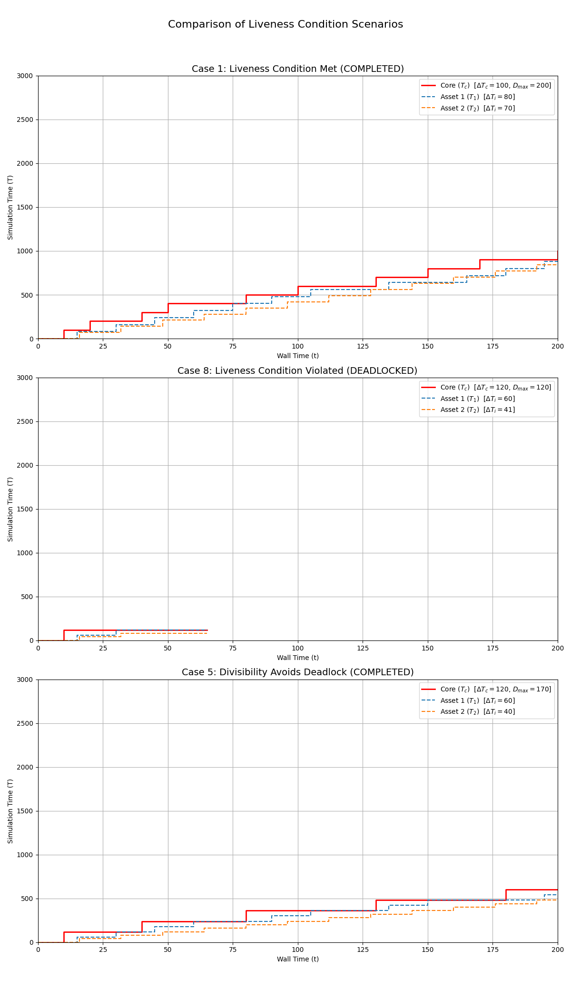

# 進行性(liveness)に関する追加実験と考察

## 目的

`hakoniwa-time.md`で定義された進行性の条件（ $D_{max} \geq \Delta T_c + \max(\Delta T_i)$ ）のときに進行性が保証されることを実験で示すとともに、例外としてそれが破られたときでも、「割り切れる条件」に合致すれば進行性を保証できることを実験で示す。

## 一般進行性条件

`hakoniwa-time.md`で示されている通り、システムの進行性（liveness）、すなわちシミュレーションが決して停止しないことを保証するためには、デッドロックを回避する必要がある。デッドロックは、コアとすべてのアセットが同時にお互いを待ち合い、進行（カウントアップ）できなくなる状態を指す。

このデッドロックを確実に回避するための十分条件として、以下の不等式が導出されている。

$
D_{max} \geq \Delta T_c + \max(\Delta T_i)
$

この条件は、すべてのアセットが同時に停留している「最悪のケース」を想定しても、必ずコアが進行できることを保証するものである。本実験は、この一般条件のもとで進行をシミュレーションして確かめるとともに、
特定の条件下（割り切れる条件）では進行性が保証されることを示すものである。

## 仮説

### 1. 後方デッドゾーンの定義

アセット $i$ のシミュレーション時刻 $T_i$ が、コア時刻 $T_c$ に対して $T_c - \Delta T_i < T_i < T_c$ の範囲内に存在する場合、そのアセットは自身のカウントアップ規則（ $T_i + \Delta T_i > T_c$ となるため）により必ず停留（stall）する。この領域を「後方デッドゾーン」と定義する。

### 2. 進行性を保証する「割り切れる条件」

もしコアの時間間隔 $\Delta T_c$ が、あるアセット $i$ の時間間隔 $\Delta T_i$ の整数倍である（ $\Delta T_c \pmod{\Delta T_i} = 0$ ）ならば、そのアセット $i$ は「後方デッドゾーン」に入ることが数学的に不可能となる。

これにより、たとえ論文の進行性条件が満たされない（ $D_{max}$ が不足する）場合でも、この「割り切れる条件」が全アセットに対して満たされていればシステムはデッドロックしない、という仮説を立てた。

#### 「割り切れる条件」の十分性の証明

**前提:**
1. 各コンポーネントのシミュレーション時刻 $T$ は、自身の時間間隔 $\Delta T$ の積み上げでのみ変化する。 $T$ の初期値は0であるため、 $T_c$ は常に $\Delta T_c$ の整数倍、 $T_i$ は常に $\Delta T_i$ の整数倍となる。
   - $T_c = k \cdot \Delta T_c$ （ $k$ は0以上の整数）
   - $T_i = m \cdot \Delta T_i$ （ $m$ は0以上の整数）
2. 「割り切れる条件」より、 $\Delta T_c$ は $\Delta T_i$ の整数倍である。
   - $\Delta T_c = q \cdot \Delta T_i$ （ $q$ は1以上の整数）

**証明（背理法）:**
1. アセット $i$ が「後方デッドゾーン」に入ったと仮定する。すると、以下の不等式が成立する。
   $
   T_c - \Delta T_i < T_i < T_c
   $
2. 前提1, 2より、 $T_c = k \cdot (q \cdot \Delta T_i)$ となり、 $T_c$ も $\Delta T_i$ の整数倍である。 $T_i$ も $\Delta T_i$ の整数倍であるから、この不等式の各項を $\Delta T_i$ で割ることができる。
   $
   (T_c / \Delta T_i) - 1 < (T_i / \Delta T_i) < (T_c / \Delta T_i)
   $
3. $N_c = T_c / \Delta T_i$ 、 $N_i = T_i / \Delta T_i$ と置くと、 $N_c$ と $N_i$ は共に整数である。不等式は以下のように書き換えられる。
   $
   N_c - 1 < N_i < N_c
   $
4. この式は、「整数 $N_i$ が、連続する2つの整数 $N_c - 1$ と $N_c$ の間に存在する」ことを意味する。しかし、そのような整数は存在しないため、これは数学的な矛盾である。
5. したがって、最初の仮定（アセット $i$ が「後方デッドゾーン」に入った）が誤りである。

**結論:**
「割り切れる条件」が成立するアセットは、原理的に「後方デッドゾーン」に入らない。これにより、この種のデッドロックが回避されることが証明された。

## 実験プログラムの概要

`hakoniwa-time.md`の定義に基づき、コアとアセットの動作を模擬するPythonプログラムを作成した。このプログラムは $D_{max}$ 、 $\Delta T_c$ 、 $\Delta T_i$ 等のパラメータを任意に設定し、デッドロックを自動検出・分析する機能を持つ。

## 実験結果

以下の画像は、3つの代表的なケースにおけるシミュレーション結果を比較したものである。各グラフの凡例には、そのケースで使用された主要パラメータを記載している。

1.  **ケース1 (上段)**: 一般進行性条件を満たす安全な構成。シミュレーションは問題なく完了する。
2.  **ケース8 (中段)**: 一般進行性条件と割り切れる条件の両方を満たさない不安定な構成。シミュレーションはデッドロックに陥り、途中で進行が停止している。
3.  **ケース5 (下段)**: 一般進行性条件は満たさないが、「割り切れる条件」を満たす構成。デッドロックは回避され、シミュレーションは正常に完了する。

